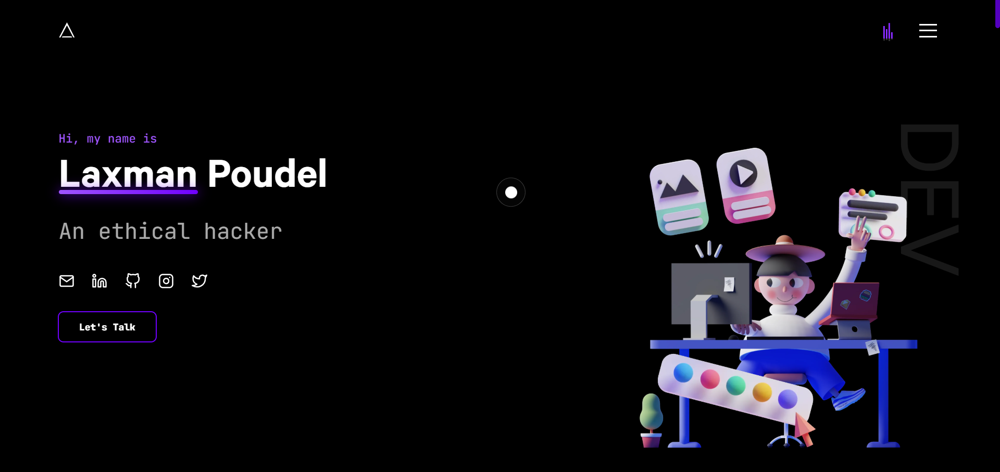

# Devfolio - Laxman Poudel's Portfolio

  
  

👨‍💻 A modern and eye-catching developer portfolio showcasing my work as an ethical hacker, UI/UX developer, and software developer based in Ratuwamai-10, Morang, Nepal.

### ✨ [Live Demo](https://www.laxmanpoudel.com.np)

## About This Project

This portfolio website is built with cutting-edge web technologies to showcase my skills, projects, and experience. It features:

- **Next.js**: React-based framework for production
- **GSAP**: Professional-grade animation library
- **Tailwind CSS**: Utility-first CSS framework
- **Framer Motion**: Smooth, declarative animations
- **Responsive Design**: Works on all device sizes

## Getting Started

In the project directory, you can run:

### `yarn install`

Installs all the necessary dependencies for the project.

### `yarn dev`

Runs the app in development mode.\
Open [http://localhost:3000](http://localhost:3000) to view it in the browser.

The page will reload if you make edits.\
You will also see any lint errors in the console.

### `yarn build`

Builds the app for production to the `build` folder.\
It correctly bundles React in production mode and optimizes the build for the best performance.

### `yarn start`

Runs the built app in production mode.

## Features

- 🎨 Modern UI/UX design
- 📱 Fully responsive layout
- 🚀 Smooth animations and transitions
- 📧 Contact form with FormSubmit.co integration
- 🌙 Dark theme optimized
- 📈 SEO optimized
- 🚀 Fast loading times

## Customization

To customize this portfolio for your own use:

1. Update personal information in `constants.js`
2. Replace project details in the PROJECTS array
3. Modify work experience in WORK_CONTENTS
4. Update social media links in SOCIAL_LINKS
5. Replace images in the `public` directory
6. Update the email address in the contact form

## Technologies Used

- **Frontend**: Next.js, React, Tailwind CSS
- **Animations**: GSAP, Framer Motion
- **Form Handling**: FormSubmit.co
- **Fonts**: Custom font loading with next/font
- **Deployment**: Vercel (recommended)

## Deployment

The easiest way to deploy your Next.js app is to use the [Vercel Platform](https://vercel.com/new?utm_medium=default-template&filter=next.js&utm_source=create-next-app&utm_campaign=create-next-app-readme) from the creators of Next.js.

Check out the [Next.js deployment documentation](https://nextjs.org/docs/deployment) for more details.

## Contributing

While this is a personal portfolio template, contributions to improve the base template are welcome:

1. Fork the Project
2. Create your Feature Branch (`git checkout -b feature/AmazingFeature`)
3. Commit your Changes (`git commit -m 'Add some AmazingFeature'`)
4. Push to the Branch (`git push origin feature/AmazingFeature`)
5. Open a Pull Request

## License

This project is licensed under the MIT License - see the [LICENSE.md](LICENSE.md) file for details.

## Acknowledgments

- Original template by [Shubh Porwal](https://github.com/shubh73/devfolio)
- [Next.js Documentation](https://nextjs.org/docs)
- [GSAP Documentation](https://greensock.com/docs/)
- [Tailwind CSS Documentation](https://tailwindcss.com/docs)

---

Developed with ❤️ by [Laxman Poudel](https://www.laxmanpoudel.com.np)